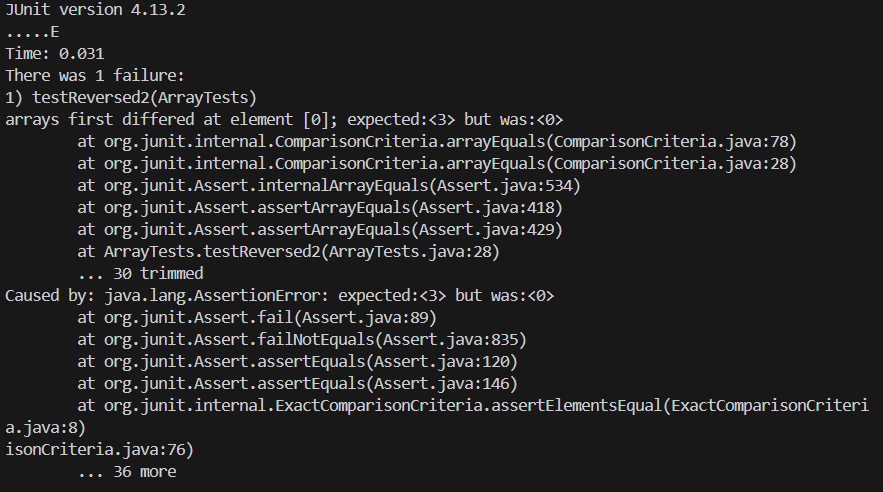
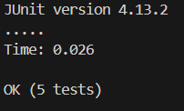

# Part 1
Array Methods from week 4's lab:
* Failure-inducing input:
    * JUnit test:
  ```
  public void testReversed2() {
    int[] input1 = {1, 2, 3};
    assertArrayEquals(new int[]{3, 2, 1}, ArrayExamples.reversed(input1));
  }
  ```
    * Associated Code:
```
  static int[] reversed(int[] arr) {
    int[] newArray = new int[arr.length];
    for(int i = 0; i < arr.length; i += 1) {
      arr[i] = newArray[arr.length - i - 1];
    }
    return arr;
  }
```
* Input that doesn't induce failure:
    * JUnit test
  ```
  public void testReversed() {
    int[] input1 = { };
    assertArrayEquals(new int[]{ }, ArrayExamples.reversed(input1));
  }
  ```
    * Associated Code:
  ```
    static int[] reversed(int[] arr) {
    int[] newArray = new int[arr.length];
    for(int i = 0; i < arr.length; i += 1) {
      arr[i] = newArray[arr.length - i - 1];
    }
    return arr;
  }
  ```
  * Symptoms:
     * Failure-Inducing Input:\
       
     * Input that doesn't induce failure:\
       
  * Bug:
     * Before:
```
  static int[] reversed(int[] arr) {
    int[] newArray = new int[arr.length];
    for(int i = 0; i < arr.length; i += 1) {
      arr[i] = newArray[arr.length - i - 1];
    }
    return arr;
  }
```
   * After:
```
  static int[] reversed(int[] arr) {
    int[] newArray = new int[arr.length];
    for(int i = 0; i < arr.length; i += 1) {
      newArray[i] = arr[arr.length - i - 1];
    }
    return newArray;
  }
```
   * Why this fixes the issue:
      * Initially, a new int array is created with `array.length` elements, all initialized to `0`. Becuase of this,
        the for loop sets each element in `arr` to `0`.
      * To fix this, in the for loop, we made it so it sets each element in the newly craeted `newArray` to the elements
        in `arr` starting from the end.

## Part 2: `Grep`
# -n
```
$ grep -n journal find-results.txt 
2:technical/plos/journal.pbio.0020001.txt
3:technical/plos/journal.pbio.0020010.txt
4:technical/plos/journal.pbio.0020012.txt
5:technical/plos/journal.pbio.0020013.txt
6:technical/plos/journal.pbio.0020019.txt
7:technical/plos/journal.pbio.0020028.txt
8:technical/plos/journal.pbio.0020035.txt
9:technical/plos/journal.pbio.0020040.txt
10:technical/plos/journal.pbio.0020042.txt
11:technical/plos/journal.pbio.0020043.txt
12:technical/plos/journal.pbio.0020046.txt
13:technical/plos/journal.pbio.0020047.txt
14:technical/plos/journal.pbio.0020052.txt
15:technical/plos/journal.pbio.0020053.txt
16:technical/plos/journal.pbio.0020054.txt
17:technical/plos/journal.pbio.0020063.txt
18:technical/plos/journal.pbio.0020064.txt
19:technical/plos/journal.pbio.0020067.txt
20:technical/plos/journal.pbio.0020068.txt
21:technical/plos/journal.pbio.0020071.txt
22:technical/plos/journal.pbio.0020073.txt
23:technical/plos/journal.pbio.0020100.txt
24:technical/plos/journal.pbio.0020101.txt
25:technical/plos/journal.pbio.0020105.txt
26:technical/plos/journal.pbio.0020112.txt
27:technical/plos/journal.pbio.0020113.txt
28:technical/plos/journal.pbio.0020116.txt
29:technical/plos/journal.pbio.0020121.txt
30:technical/plos/journal.pbio.0020125.txt
31:technical/plos/journal.pbio.0020127.txt
32:technical/plos/journal.pbio.0020133.txt
33:technical/plos/journal.pbio.0020140.txt
34:technical/plos/journal.pbio.0020145.txt
35:technical/plos/journal.pbio.0020146.txt
36:technical/plos/journal.pbio.0020147.txt
37:technical/plos/journal.pbio.0020148.txt
38:technical/plos/journal.pbio.0020150.txt
39:technical/plos/journal.pbio.0020156.txt
40:technical/plos/journal.pbio.0020161.txt
41:technical/plos/journal.pbio.0020164.txt
42:technical/plos/journal.pbio.0020169.txt
43:technical/plos/journal.pbio.0020172.txt
44:technical/plos/journal.pbio.0020183.txt
45:technical/plos/journal.pbio.0020187.txt
46:technical/plos/journal.pbio.0020190.txt
47:technical/plos/journal.pbio.0020206.txt
48:technical/plos/journal.pbio.0020213.txt
49:technical/plos/journal.pbio.0020214.txt
50:technical/plos/journal.pbio.0020215.txt
51:technical/plos/journal.pbio.0020216.txt
52:technical/plos/journal.pbio.0020223.txt
53:technical/plos/journal.pbio.0020224.txt
54:technical/plos/journal.pbio.0020228.txt
55:technical/plos/journal.pbio.0020232.txt
56:technical/plos/journal.pbio.0020241.txt
57:technical/plos/journal.pbio.0020262.txt
58:technical/plos/journal.pbio.0020263.txt
59:technical/plos/journal.pbio.0020267.txt
60:technical/plos/journal.pbio.0020272.txt
61:technical/plos/journal.pbio.0020276.txt
62:technical/plos/journal.pbio.0020297.txt
63:technical/plos/journal.pbio.0020302.txt
64:technical/plos/journal.pbio.0020306.txt
65:technical/plos/journal.pbio.0020307.txt
66:technical/plos/journal.pbio.0020310.txt
67:technical/plos/journal.pbio.0020311.txt
68:technical/plos/journal.pbio.0020337.txt
69:technical/plos/journal.pbio.0020346.txt
70:technical/plos/journal.pbio.0020347.txt
71:technical/plos/journal.pbio.0020348.txt
72:technical/plos/journal.pbio.0020350.txt
73:technical/plos/journal.pbio.0020353.txt
74:technical/plos/journal.pbio.0020354.txt
75:technical/plos/journal.pbio.0020394.txt
76:technical/plos/journal.pbio.0020400.txt
77:technical/plos/journal.pbio.0020401.txt
78:technical/plos/journal.pbio.0020404.txt
79:technical/plos/journal.pbio.0020406.txt
80:technical/plos/journal.pbio.0020419.txt
81:technical/plos/journal.pbio.0020420.txt
82:technical/plos/journal.pbio.0020430.txt
83:technical/plos/journal.pbio.0020431.txt
84:technical/plos/journal.pbio.0020439.txt
85:technical/plos/journal.pbio.0020440.txt
86:technical/plos/journal.pbio.0030021.txt
87:technical/plos/journal.pbio.0030024.txt
88:technical/plos/journal.pbio.0030032.txt
89:technical/plos/journal.pbio.0030050.txt
90:technical/plos/journal.pbio.0030051.txt
91:technical/plos/journal.pbio.0030056.txt
92:technical/plos/journal.pbio.0030062.txt
93:technical/plos/journal.pbio.0030065.txt
94:technical/plos/journal.pbio.0030076.txt
95:technical/plos/journal.pbio.0030094.txt
96:technical/plos/journal.pbio.0030097.txt
97:technical/plos/journal.pbio.0030102.txt
98:technical/plos/journal.pbio.0030105.txt
99:technical/plos/journal.pbio.0030127.txt
100:technical/plos/journal.pbio.0030129.txt
101:technical/plos/journal.pbio.0030131.txt
102:technical/plos/journal.pbio.0030136.txt
103:technical/plos/journal.pbio.0030137.txt
```
* This command find all instances of the word `journal` in `find-results.txt` and displays all the lines containing the word and their line numbers.
  This can be useful when you want to see all the  lines containing `journal` from `find-results.txt`.
```
$ grep -n "8:25" technical/911report/chapter-1.txt
80:    Boston Center knew of a problem on the flight in part because just before 8:25 the hijackers had attempted to communicate with the passengers. The microphone was keyed, and immediately one of the hijackers said, "Nobody move. Everything will be okay. If you try to make any moves, you'll endanger yourself and the airplane. Just stay quiet." Air traffic controllers heard the transmission; Ong did not. The hijackers probably did not know how to operate the cockpit radio communication system correctly, and thus inadvertently broadcast their message over the air traffic control channel instead of the cabin public-address channel. Also at 8:25, and again at 8:29, Amy Sweeney got through to the American Flight Services Office in Boston but was cut off after she reported someone was hurt aboard the flight. Three minutes later, Sweeney was reconnected to the office and began relaying updates to the manager, Michael Woodward.
154:    At the same time, Boston Center realized that a message transmitted just before 8:25 by the hijacker pilot of American 11 included the phrase, "We have some planes." 
278:    Between 8:25 and 8:32, in accordance with the FAA protocol, Boston Center managers started notifying their chain of command that American 11 had been hijacked. At 8:28, Boston Center called the Command Center in Herndon to advise that it believed American 11 had been hijacked and was heading toward New York Center's airspace.
```
* This command finds all instances of `8:25` in the `chapter-1.txt` file and displays all the lines containing that pattern and their line numbers.
  This can be useful when you want to see the events that happened at `8:25`.
# -v
```
$ grep -v ".txt" find-results.txt 
technical/plos/
```
* This command finds all lines containing `.txt` and displays all lines not containing that pattern. This can be useful when you
  want to see how many lines don't contain `.txt`.
```
$ grep -v "journal" find-results.txt 
technical/plos/
technical/plos/pmed.0010008.txt
technical/plos/pmed.0010010.txt
technical/plos/pmed.0010013.txt
technical/plos/pmed.0010021.txt
technical/plos/pmed.0010022.txt
technical/plos/pmed.0010023.txt
technical/plos/pmed.0010024.txt
technical/plos/pmed.0010025.txt
technical/plos/pmed.0010026.txt
technical/plos/pmed.0010028.txt
technical/plos/pmed.0010029.txt
technical/plos/pmed.0010030.txt
technical/plos/pmed.0010034.txt
technical/plos/pmed.0010036.txt
technical/plos/pmed.0010039.txt
technical/plos/pmed.0010041.txt
technical/plos/pmed.0010042.txt
technical/plos/pmed.0010045.txt
technical/plos/pmed.0010046.txt
technical/plos/pmed.0010047.txt
technical/plos/pmed.0010048.txt
technical/plos/pmed.0010049.txt
technical/plos/pmed.0010050.txt
technical/plos/pmed.0010051.txt
technical/plos/pmed.0010052.txt
technical/plos/pmed.0010056.txt
technical/plos/pmed.0010058.txt
technical/plos/pmed.0010060.txt
technical/plos/pmed.0010061.txt
technical/plos/pmed.0010062.txt
technical/plos/pmed.0010064.txt
technical/plos/pmed.0010066.txt
technical/plos/pmed.0010067.txt
technical/plos/pmed.0010068.txt
technical/plos/pmed.0010069.txt
technical/plos/pmed.0010070.txt
technical/plos/pmed.0010071.txt
technical/plos/pmed.0020002.txt
technical/plos/pmed.0020005.txt
technical/plos/pmed.0020007.txt
technical/plos/pmed.0020009.txt
technical/plos/pmed.0020015.txt
technical/plos/pmed.0020016.txt
technical/plos/pmed.0020017.txt
technical/plos/pmed.0020018.txt
technical/plos/pmed.0020019.txt
technical/plos/pmed.0020020.txt
technical/plos/pmed.0020021.txt
technical/plos/pmed.0020022.txt
technical/plos/pmed.0020023.txt
technical/plos/pmed.0020024.txt
technical/plos/pmed.0020027.txt
technical/plos/pmed.0020028.txt
technical/plos/pmed.0020033.txt
technical/plos/pmed.0020034.txt
technical/plos/pmed.0020035.txt
technical/plos/pmed.0020036.txt
technical/plos/pmed.0020039.txt
technical/plos/pmed.0020040.txt
technical/plos/pmed.0020045.txt
technical/plos/pmed.0020047.txt
technical/plos/pmed.0020048.txt
technical/plos/pmed.0020050.txt
technical/plos/pmed.0020055.txt
technical/plos/pmed.0020059.txt
technical/plos/pmed.0020060.txt
technical/plos/pmed.0020061.txt
technical/plos/pmed.0020062.txt
technical/plos/pmed.0020065.txt
technical/plos/pmed.0020067.txt
technical/plos/pmed.0020068.txt
technical/plos/pmed.0020071.txt
technical/plos/pmed.0020073.txt
technical/plos/pmed.0020074.txt
technical/plos/pmed.0020075.txt
technical/plos/pmed.0020082.txt
technical/plos/pmed.0020085.txt
technical/plos/pmed.0020086.txt
technical/plos/pmed.0020088.txt
technical/plos/pmed.0020090.txt
technical/plos/pmed.0020091.txt
technical/plos/pmed.0020094.txt
technical/plos/pmed.0020098.txt
technical/plos/pmed.0020099.txt
technical/plos/pmed.0020102.txt
technical/plos/pmed.0020103.txt
technical/plos/pmed.0020104.txt
technical/plos/pmed.0020113.txt
technical/plos/pmed.0020114.txt
technical/plos/pmed.0020115.txt
technical/plos/pmed.0020116.txt
technical/plos/pmed.0020117.txt
technical/plos/pmed.0020118.txt
technical/plos/pmed.0020120.txt
technical/plos/pmed.0020123.txt
technical/plos/pmed.0020140.txt
technical/plos/pmed.0020144.txt
technical/plos/pmed.0020145.txt
technical/plos/pmed.0020146.txt
technical/plos/pmed.0020148.txt
technical/plos/pmed.0020149.txt
technical/plos/pmed.0020150.txt
technical/plos/pmed.0020155.txt
technical/plos/pmed.0020157.txt
technical/plos/pmed.0020158.txt
technical/plos/pmed.0020160.txt
technical/plos/pmed.0020161.txt
technical/plos/pmed.0020162.txt
technical/plos/pmed.0020180.txt
technical/plos/pmed.0020181.txt
technical/plos/pmed.0020182.txt
technical/plos/pmed.0020187.txt
technical/plos/pmed.0020189.txt
technical/plos/pmed.0020191.txt
technical/plos/pmed.0020192.txt
technical/plos/pmed.0020194.txt
technical/plos/pmed.0020195.txt
technical/plos/pmed.0020196.txt
technical/plos/pmed.0020197.txt
technical/plos/pmed.0020198.txt
technical/plos/pmed.0020200.txt
technical/plos/pmed.0020201.txt
technical/plos/pmed.0020203.txt
technical/plos/pmed.0020206.txt
technical/plos/pmed.0020208.txt
technical/plos/pmed.0020209.txt
technical/plos/pmed.0020210.txt
technical/plos/pmed.0020212.txt
technical/plos/pmed.0020216.txt
technical/plos/pmed.0020226.txt
technical/plos/pmed.0020231.txt
technical/plos/pmed.0020232.txt
technical/plos/pmed.0020235.txt
technical/plos/pmed.0020236.txt
technical/plos/pmed.0020237.txt
technical/plos/pmed.0020238.txt
technical/plos/pmed.0020239.txt
technical/plos/pmed.0020242.txt
technical/plos/pmed.0020246.txt
technical/plos/pmed.0020247.txt
technical/plos/pmed.0020249.txt
technical/plos/pmed.0020257.txt
technical/plos/pmed.0020258.txt
technical/plos/pmed.0020268.txt
technical/plos/pmed.0020272.txt
technical/plos/pmed.0020273.txt
technical/plos/pmed.0020274.txt
technical/plos/pmed.0020275.txt
technical/plos/pmed.0020278.txt
technical/plos/pmed.0020281.txt
```
* This command excludes the lines with `journal` and displays all other lines. This can be useful when you want to see
  how all lines that doesn't include the word `journal` or in this case, all the files in the `plos` directory that doesn't include `journal`
  in their name.
# -c
```
$ grep -c "hijacking" technical/911report/chapter-1.txt
39
```
* This commands counts the number of occurrences of the pattern `hijacking` in the file `chapter-1.txt` from the `911report` directory.
  This can be useful if you want to see how many times the phrase `hijacking` was mentioned in the first chapter alone.
```
$ grep -c "DNA" technical/plos/journal.pbio.0020035.txt 
3
```
* This commands counts the number of occurrences of the pattern `DNA` in the file `journal.pbio.0020035.txt` from the `plos` directory.
  This can be useful if you want to see how many times the phrase `DNA` was mentioned in this file
# -l
```
$ grep -r -l "Bin Ladin" technical/911report/
technical/911report/chapter-10.txt
technical/911report/chapter-11.txt
technical/911report/chapter-12.txt
technical/911report/chapter-13.2.txt
technical/911report/chapter-13.3.txt
technical/911report/chapter-13.4.txt
technical/911report/chapter-13.5.txt
technical/911report/chapter-2.txt
technical/911report/chapter-3.txt
technical/911report/chapter-5.txt
technical/911report/chapter-6.txt
technical/911report/chapter-7.txt
technical/911report/chapter-8.txt
```
* This command searches the `911report` directory recursively and displays all of the files containing the pattern `Bin Ladin`.
  This can be useful when you want to know which files contains which patterns so you don't have to manually look through every file.
```
$ grep -r -l "drug" technical/government/
technical/government/About_LSC/commission_report.txt
technical/government/About_LSC/Special_report_to_congress.txt
technical/government/About_LSC/State_Planning_Special_Report.txt
technical/government/Alcohol_Problems/DraftRecom-PDF.txt
technical/government/Alcohol_Problems/Session2-PDF.txt
technical/government/Alcohol_Problems/Session3-PDF.txt
technical/government/Alcohol_Problems/Session4-PDF.txt
technical/government/Gen_Account_Office/d01591sp.txt
technical/government/Gen_Account_Office/og97002.txt
technical/government/Gen_Account_Office/og99036.txt
technical/government/Gen_Account_Office/Statements_Feb28-1997_volume.txt
technical/government/Gen_Account_Office/Testimony_cg00010t.txt
technical/government/Gen_Account_Office/Testimony_Jul17-2002_d02957t.txt
technical/government/Media/Abuse_penalties.txt
technical/government/Media/Annual_Fee.txt
technical/government/Media/BergenCountyRecord.txt
technical/government/Media/Eviction_law.txt
technical/government/Media/FY_04_Budget_Outlook.txt
technical/government/Media/Higher_Registration_Fees.txt
technical/government/Media/highlight_Senior_Day.txt
technical/government/Media/Paralegal_Honored.txt
technical/government/Media/The_State_of_Pro_Bono.txt
technical/government/Media/Unusual_Woodburn.txt
technical/government/Media/Weak_economy.txt
```
* This command searches the `government` directory recursively and displays all of the files containing the pattern `drug`.
  This can be useful when you want to know which files contains which drug so you can navigate to them quicker.

# Source Citing
All these command-line options were found using `grep --help` in the terminal.
