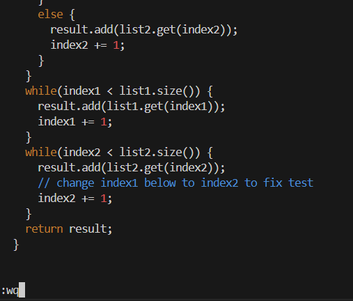
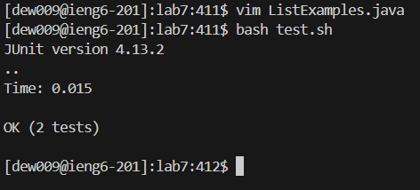
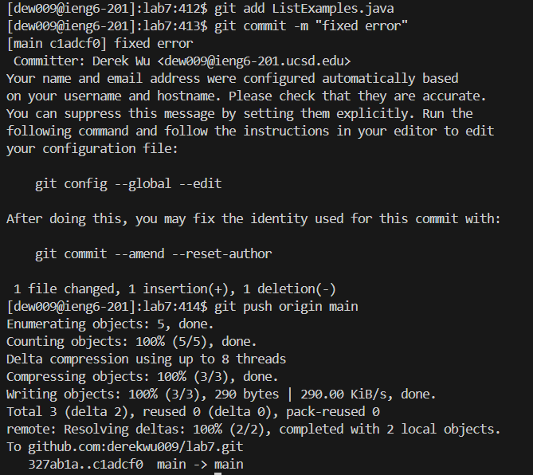

# Step 4

* ssh dew009@ieng6.ucsd.edu`<enter>`
   * This logs into ieng6.

# Step 5

* git clone git@github.com:derekwu009/lab7.git `<enter>`
  * This clones my fork of the repository using the ssh url

# Step 6

* cd lab`<tab>`
    * Pressed tab to autocomplete from `lab` to `lab7` and this goes into the `lab7` directory
* ls
    * This lists all the files in the directory
* bash te`<tab>`
    * This runs the test.sh script and I pressed tab to autocomplete from `te` to `test.sh`

# Step 7

* vim List`<tab>`.j`<tab>` `<enter>`44Ger2:wq`<enter>`
   * The first `tab` after `List` autocompletes to ListExamples, and the `tab` aftrer `.j` autocompletes to java.
   * `44G` goes to line 44
   * `e` goes to the end of `index1` and `r2` replaces `1` with `2`
   * `:wq:` `<enter>` saves and exits the file

# Step 8

* bash t`<tab>` `<enter>`
   * The `tab` after `t` autocompletes to `test.sh` and `enter` executes the command, which runs the test again

# Step 9

* git add List`<tab>`.j`<tab>` `<enter>`
   * `git add` adds the modified file into the staging area from the working directory
   * The `tab` following `List` autocompletes to ListExamples, and the `tab` after `.j` autocompletes to java.
* git commit -m "fixed error"`<enter>`
   * `git commit` saves a snapshot of the current state of the local repository
   * `-m "fixed error"` is the message associated with the commit
   * `<enter>` executes this command 
* git push origin main`<enter>`
   * `git push origin main` pushes the changes from the local repository to the remote repository and `<enter>` executes the command
