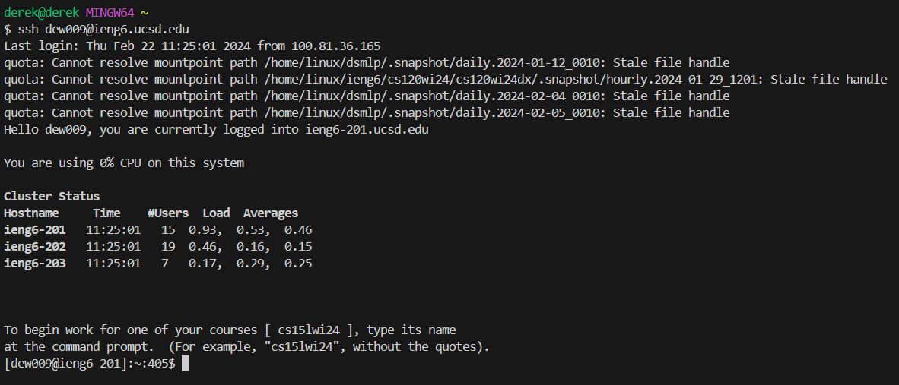
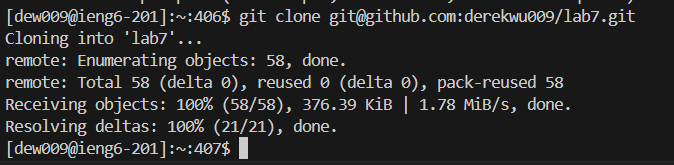
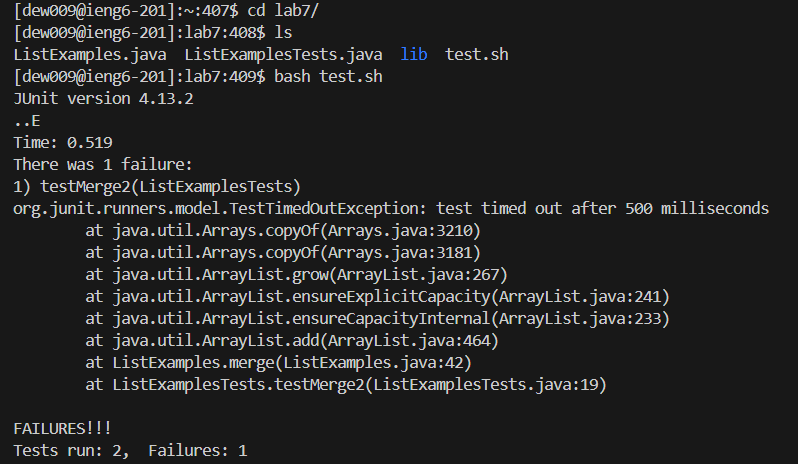

# Step 4

* ssh dew009@ieng6.ucsd.edu`<enter>`
* This logs into ieng6.

# Step 5

* git clone git@github.com:derekwu009/lab7.git `<enter>`
* This clones my fork of the repository using the ssh url

# Step 6

* cd lab`<tab>`
    * Pressed tab to autocomplete and this goes into the `lab7` directory
* ls
    * This lists all the files in the directory
* bash te`<tab>`
    * This runs the test.sh script and I pressed tab to autocomplete.

Step 4: ssh dew009@ieng6.ucsd.edu<enter>
Step 5: git clone git@github.com:derekwu009/lab7.git <enter>
Step 6: cd lab<Tab> 
        ls
        bash te<tab>
Step 7: vim L<tab>.j<tab><enter>
        44Ger2:wq
Step 8: <enter>bash t<tab><enter>
Step 9: git add L<tab><enter>
        git commit -m "fixed error"<enter>
        git push origin main<enter>
