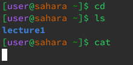
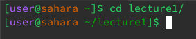
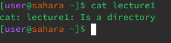
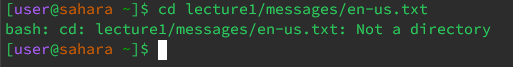
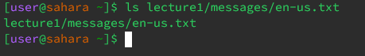
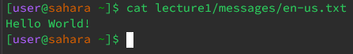

# Example of using `cd`, `ls`, `cat` with *no arguments*:

* The working directory when these commands were ran was: `/home`
* For the `cd` command, I was returned to the `home` directory because there were no arguments.\
  For the `ls` command, the output was `lecture1` because that is the folder within the current directory, `/home`.\
  For the `cat` command, there was also no output but the terminal was still waiting for an input because `cat` takes in a path as an argument.
* None of the outputs were errors.

# Example of using `cd`, `ls`, `cat` with a path to a *directory* as an arugment:

* Working directory when command was run: `/home`.
* I got the output because the directory changed from `/home` to `/home/lecture1`.
* Output was not an error.
  

* Working directory when command was run: `/home`.
* I got the output because the `folders` and `files` in the argument `directory`, `lecture1` are shown.
* Output was not an error.
  

* Working directory when command was run: `/home`.
* I got the output because the command was used with a `directory` as an argument instead of a `file`.
* There was an error because the argument was a `directory` instead of a `file` and the `cat` command doesn't take paths to `directories` as an argument.

# Example of using `cd`, `ls`, `cat` with a path to a *file* as an arugment:

* Working directory when command was run: `/home`.
* I got the output because the argument was a path to a `file` instead of a `directory`.
* The output is an error because the command was used with a path to a `file` instead of a `directory`.

* Working directory when command was run: `/home`.
* I got this output because the argument that was used is a path to a `file`, so the `file` was listed.
* Output was not an error.

* Working directory when command was run: `/home`.
* I got this output because the contents of the `file`, "Hello World!", was read by the `cat` command.
* Output was not an error.
