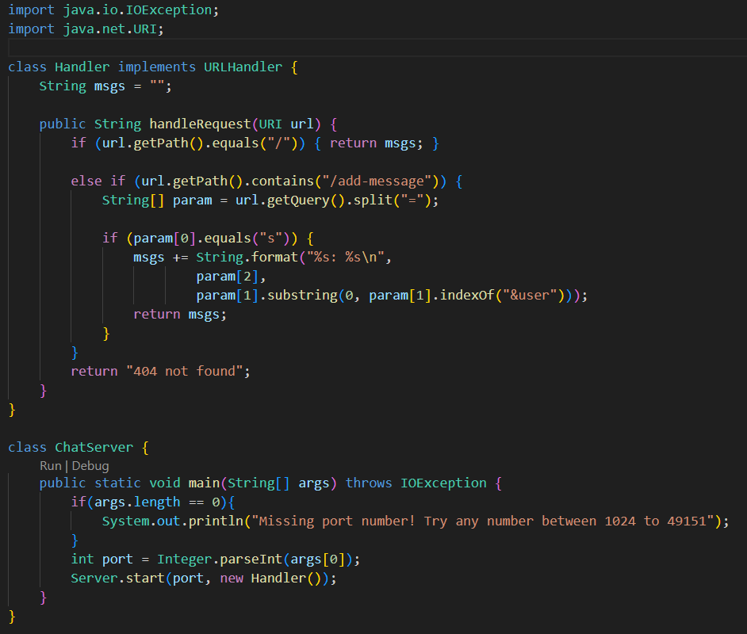
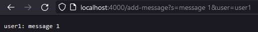
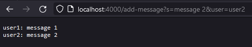

# Part 1 | Code

# Part 1 | Website Messages

* The methods that are called: `main`, `parseInt()`, `new Handler()`, `Server.start()`, `handleRequest()`, `getPath()`, `getQuery()`, `equals()`, `contains()`, `split()`, `String.format()`, `substring()`, `indexOf()`.
* Relevant arguments to those methods: `url`, `/`, `/add-message`, `=`, `s`, `param[2]`, `param[1]`, `0`, `param[1].indexOf("&user")`, `args[0]`, `port`, `new Handler()`.
* Values of relevant fields: `""`
* After the request, the `value` of `msgs` changes from `""` to `user1: message`, followed by a `new line`.\

* The methods that are called: `main`, `parseInt()`, `new Handler()`, `Server.start()`, `handleRequest()`, `getPath()`, `getQuery()`, `equals()`, `contains()`, `split()`, `String.format()`, `substring()`, `indexOf()`.
* Relevant arguments to those methods: `url`, `/`, `/add-message`, `=`, `s`, `param[2]`, `param[1]`, `0`, `param[1].indexOf("&user")`, `args[0]`, `port`, `new Handler()`.
* Values of relevant fields: `user1: message1` followed by a `new line`.
* After the request, the `value` of `msgs` changes from `user1: message1` to `user1: message`, followed by a `new line`, and `user2: message2`.
