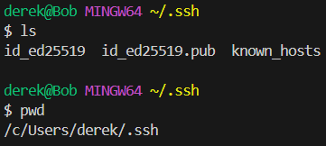
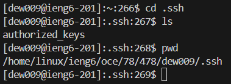
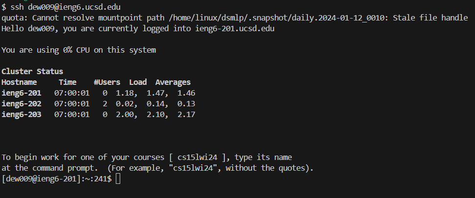

# Part 1 | Code
```
import java.io.IOException;
import java.net.URI;

class Handler implements URLHandler {
    String msgs = "";

    public String handleRequest(URI url) {        
        if (url.getPath().equals("/")) { return msgs; }

        else if (url.getPath().contains("/add-message")) {
            String[] param = url.getQuery().split("=");

            if (param[0].equals("s")) {
                msgs += String.format("%s: %s\n",
                        param[2],
                        param[1].substring(0, param[1].indexOf("&user")));
                return msgs;
            }
        }
        return "404 not found";
    }
}

class ChatServer {
    public static void main(String[] args) throws IOException {
        if(args.length == 0){
            System.out.println("Missing port number! Try any number between 1024 to 49151");
        }
        int port = Integer.parseInt(args[0]);
        Server.start(port, new Handler());
    }
}
```
# Part 1 | Website Messages

* The methods that are called: `main`, `parseInt()`, `new Handler()`, `Server.start()`, `handleRequest()`, `getPath()`, `getQuery()`, `equals()`, `contains()`, `split()`, `String.format()`, `substring()`, `indexOf()`.
* Relevant arguments to those methods: `url`, `/`, `/add-message`, `=`, `s`, `param[2]`, `param[1]`, `0`, `param[1].indexOf("&user")`, `args[0]`, `port`, `new Handler()`.
* Values of relevant fields: `""`
* After the request, the `value` of `msgs` changes from `""` to `user1: message`, followed by a `new line`.


* The methods that are called: `main`, `parseInt()`, `new Handler()`, `Server.start()`, `handleRequest()`, `getPath()`, `getQuery()`, `equals()`, `contains()`, `split()`, `String.format()`, `substring()`, `indexOf()`.
* Relevant arguments to those methods: `url`, `/`, `/add-message`, `=`, `s`, `param[2]`, `param[1]`, `0`, `param[1].indexOf("&user")`, `args[0]`, `port`, `new Handler()`.
* Values of relevant fields: `user1: message1` followed by a `new line`.
* After the request, the `value` of `msgs` changes from `user1: message1` to `user1: message`, followed by `user2: message2` on a separate line.

# Part 2
* Private key: 
* Absolute path: `/c/Users/derek/.ssh/id_ed25519`

* Public key: 
* Absolute path: `/home/linux/ieng6/oce/78/478/dew009/.ssh/authorized_keys`

* Passwordless Login: 

# Part 3
Something new I learned that I didn't know before was the `mkdir` command, which creates a new directory, and the `scp` command, which allows for remotely transferring files between two hosts.
